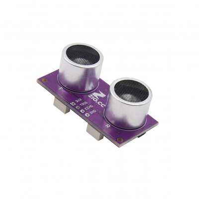

# Zio Qwiic Ultrasonic Distance Sensor (HC-SR04)

> This product can be available for purchase [here](https://www.smart-prototyping.com/Zio-Ultrasonic-Distance-Sensor.html).

#### Description

This is a [Qwiic](https://www.smart-prototyping.com/Qwiic.html) I2C version of ultrasonic sensor in our Qwiic family. TOF sensor is great, precise and fast, but this Ultrasonic sensor can provide wider detecting angle than TOF sensor and longer distance (3-400cm).

With this module we used a STM8 MCU as gateway to deal with sensor’s digital data in MCU, and send it out via I2C. So you don’t need to care about how it works inside the STM8, just trade it as an I2C device. In case you are interesting, you can check out the STM8 code at the bottom of the links.

We also break the serial pins just like the normal HC-SR04 module. The pins are not pre-soldered. We use an MCU (ATTINY85-20SU) as gateway to turn it into an I2C device.

For additional information on how the Ultrasonic sensor works, you can check out this [page](http://arduinoinfo.mywikis.net/wiki/UltraSonicDistance)!

Note: Try to avoid touching the pins and pads on the backside, the sensor measurement is based on analog single, touching these pins and pads will make the result unstable. 

#### Specification

* Operating Voltage: 3.3V
* Detecting Angle: 15 degree
* Sensor range: 2cm to 400cm
* Accuracy: 3mm
* MCU on board: STM8L051
* I2C Address: 0x00
* Dimension: 21.5x 45.5mm
* Weight: 9.2g

#### Links

* [Eagle File](https://github.com/ZIOCC/Zio-Qwiic-Ultrasonic-Distance-Sensor/)
* [Example Code](https://github.com/ZIOCC/Zio-Qwiic-Ultrasonic-Distance-Sensor/tree/master/Arduino)

###### About Zio
> Zio is a new line of open sourced, compact, and grid layout boards, fully integrated for Arduino and Qwiic ecosystem. Designed ideally for wearables, robotics, small-space limitations or other on the go projects. Check out other awesome Zio products [here](https://www.smart-prototyping.com/Zio).
